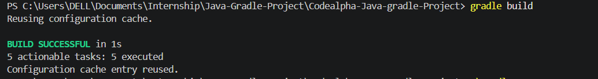
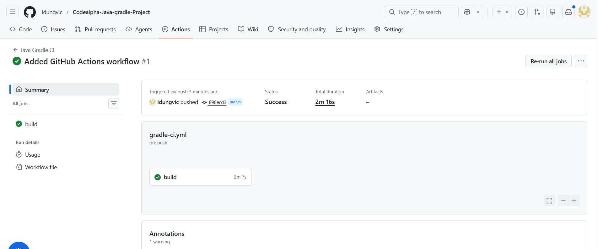

# Java Application Build Automation with Gradle

## Project Overview

This project was completed as **Task 3** of the **CodeAlpha DevOps Internship Program**. The objective was to automate the build process of a Java application using Gradle, manage project dependencies efficiently, and implement a Continuous Integration (CI) pipeline using GitHub Actions.

The project demonstrates how modern DevOps practices can be applied to Java development by automating compilation, testing, and build validation whenever code changes are pushed to the repository.

---

## Objectives

- Automate Java application builds using Gradle.
- Manage project dependencies efficiently.
- Implement Continuous Integration using GitHub Actions.
- Streamline the build process through automation.
- Gain hands-on experience with DevOps practices in Java development.

---

## Technologies Used

| Technology | Purpose |
|------------|----------|
| Java | Application Development |
| Gradle | Build Automation and Dependency Management |
| Git | Version Control |
| GitHub | Source Code Repository |
| GitHub Actions | Continuous Integration Pipeline |
| VS Code | Development Environment |

---

## Project Architecture

```text
Developer
    │
    ▼
GitHub Repository
    │
    ▼
GitHub Actions Workflow
    │
    ▼
Gradle Build Process
    │
    ├── Compile Source Code
    ├── Resolve Dependencies
    ├── Execute Tests
    └── Generate Build Artifacts
    │
    ▼
Build Successful
```

---

## Project Structure

```text
Codealpha-Java-Gradle-Project
│
├── .github
│   └── workflows
│       └── gradle-ci.yml
│
├── app
│   └── src
│       ├── main
│       │   └── java
│       └── test
│           └── java
│
├── gradle
│
├── gradlew
├── gradlew.bat
├── build.gradle
├── settings.gradle
└── README.md
```

---

## Gradle Build Configuration

Gradle was used as the primary build automation tool for this project.

Key functionalities include:

- Source code compilation
- Dependency management
- Automated testing
- Build artifact generation
- CI pipeline integration

---

## Continuous Integration Pipeline

A GitHub Actions workflow was configured to automatically build the application whenever changes are pushed to the main branch.

### Workflow Features

- Repository checkout
- Java environment setup
- Gradle wrapper execution
- Automated project build
- Build validation

### CI Workflow File

Location:

```text
.github/workflows/gradle-ci.yml
```

---

## Build Process

The application build process can be executed using the Gradle Wrapper.

### Build Application

```bash
./gradlew build
```

### Run Application

```bash
./gradlew run
```

### Clean Build Files

```bash
./gradlew clean
```

---

## Dependency Management

Gradle manages project dependencies automatically through the build configuration file.

Benefits include:

- Automated dependency downloads
- Version control for libraries
- Reduced manual configuration
- Improved project maintainability

---

## CI/CD Implementation

The CI pipeline automatically performs the following actions whenever code is pushed:

1. Checks out the repository.
2. Configures the Java runtime environment.
3. Executes the Gradle build process.
4. Compiles source code.
5. Runs automated tests.
6. Validates build success.

This ensures code quality and helps identify issues before deployment.

---

## Screenshots

The following screenshots were captured during implementation:

- Successful Gradle Build

- Successful CI Pipeline Run


---

## Key Learning Outcomes

Through this project, I gained practical experience in:

- Java application development
- Build automation using Gradle
- Dependency management
- Continuous Integration implementation
- GitHub Actions workflow creation
- Version control using Git and GitHub
- DevOps best practices for Java projects

---

## Challenges Encountered

### Gradle Build Errors

During implementation, compilation issues were encountered due to project structure and test configuration inconsistencies.

**Resolution:**

- Reviewed package structure.
- Updated project configuration.
- Verified Gradle build settings.
- Rebuilt the project successfully.

### Gradle Wrapper Download Issues

Network timeout errors occurred while downloading Gradle distributions.

**Resolution:**

- Verified internet connectivity.
- Retried Gradle wrapper execution.
- Used locally installed Gradle where necessary.

---

## Conclusion

This project successfully demonstrated how Gradle can be used to automate Java application builds and manage dependencies efficiently. The integration of GitHub Actions provided an automated Continuous Integration workflow, ensuring that code changes are validated automatically before further deployment activities.

The project strengthened my understanding of build automation, CI/CD principles, dependency management, and DevOps practices within Java development environments.

---

## Author

**Victor Idung**  
**CodeAlpha DevOps Internship Program**  
**Task 3: Java Application Using Gradle**